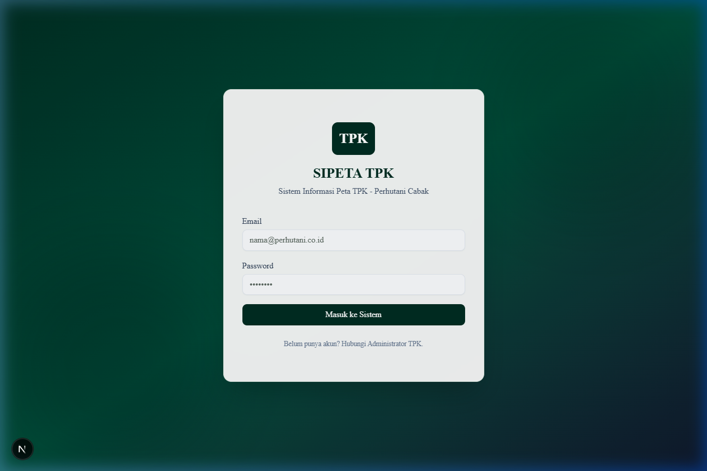
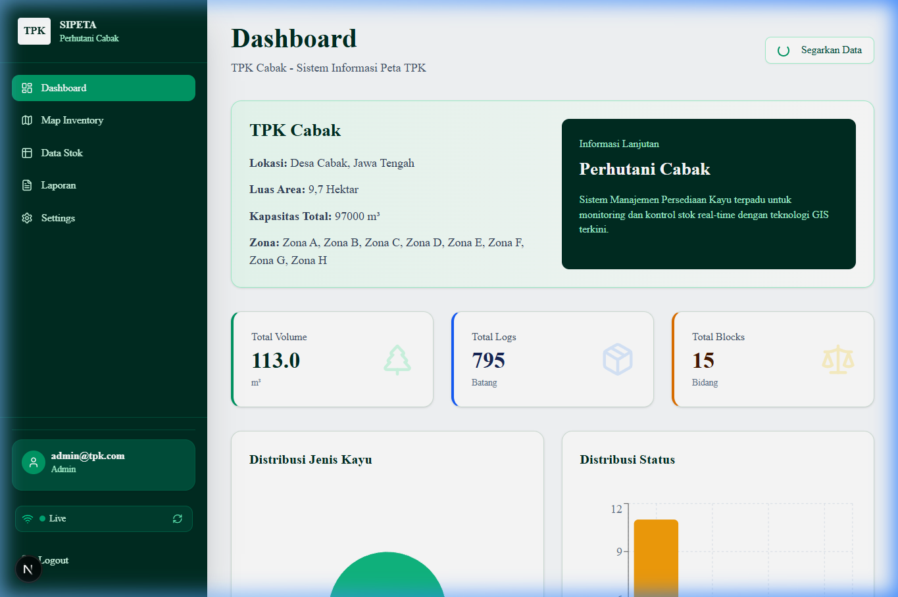
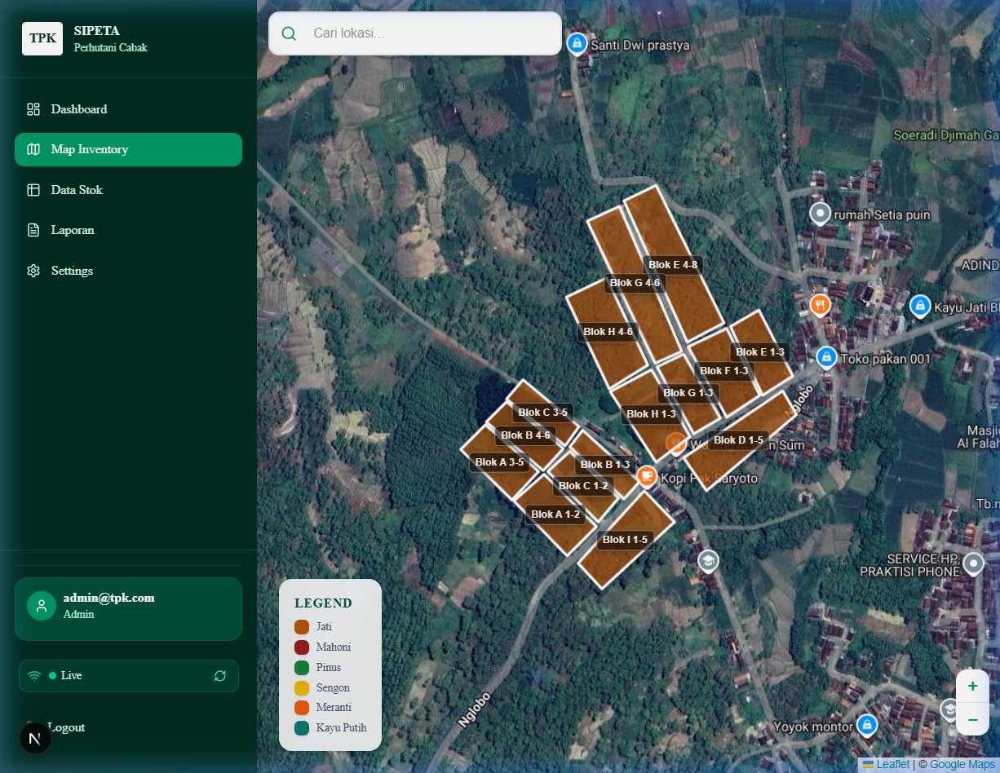
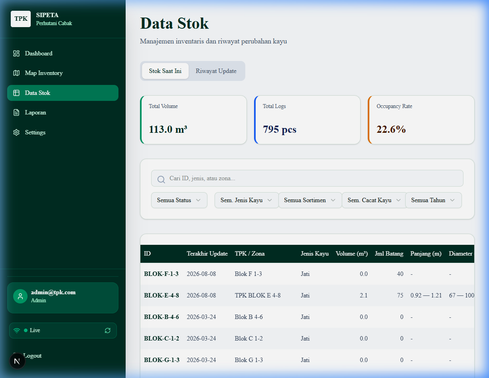
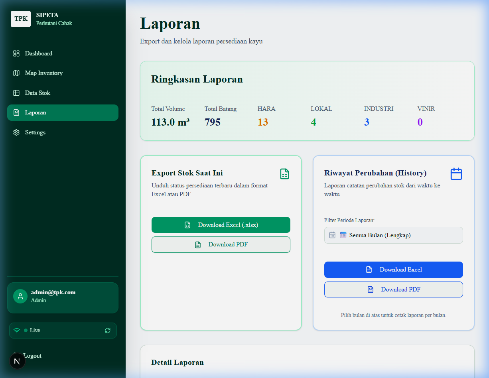
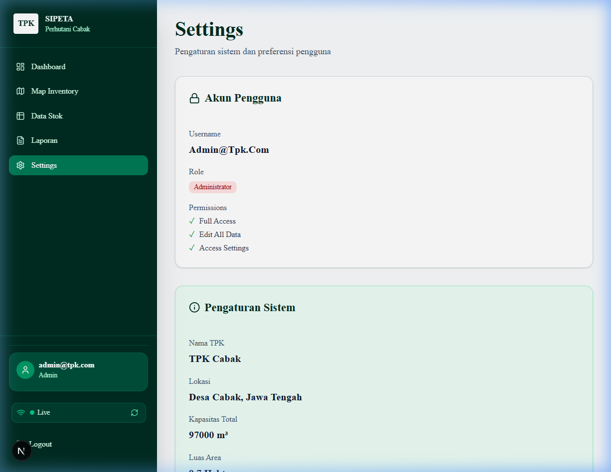

<p align="center">
  
  
  
  
  
  
</p>

# 🌲 SIPETA TPK — Sistem Informasi Peta TPK

**SIPETA TPK** (Sistem Informasi Peta Tempat Penimbunan Kayu) adalah aplikasi web berbasis **WebGIS** untuk mengelola dan memonitor persediaan kayu di Tempat Penimbunan Kayu (TPK) Perhutani Cabak, Jawa Tengah. Sistem ini menyediakan visualisasi peta interaktif, manajemen data stok kayu secara *real-time*, serta fitur ekspor laporan dalam format Excel dan PDF.

> 🏢 **Studi Kasus:** TPK Cabak, Desa Cabak, Jawa Tengah  
> 🎓 **Proyek Tugas Akhir** — Sistem Informasi

---

## 📸 Screenshot Tampilan Website

### 🔐 Halaman Login
<p align="center">
  
</p>

> Halaman login dengan autentikasi berbasis Supabase Auth. User memasukkan email dan password untuk mengakses sistem sesuai role (Admin/Staff).

### 📊 Dashboard
<p align="center">
  
</p>

> Dashboard menampilkan ringkasan data TPK Cabak meliputi: informasi lokasi & kapasitas, total volume kayu (m³), total batang kayu, jumlah blok, grafik distribusi jenis kayu (Pie Chart), dan grafik distribusi status kayu (Bar Chart). Data diperbarui secara *real-time*.

### 🗺️ Map Inventory (WebGIS)
<p align="center">
  
</p>

> Peta interaktif berbasis **Leaflet** dengan citra satelit yang menampilkan blok-blok kayu di area TPK Cabak. Setiap blok diberi warna berdasarkan jenis kayu (Jati, Mahoni, Pinus, Sengon, Meranti, Kayu Putih). User dapat klik blok untuk melihat detail dan mengedit data langsung dari peta.

### 📋 Data Stok Kayu
<p align="center">
  
</p>

> Tabel data stok kayu dengan fitur pencarian dan multi-filter (status, jenis kayu, sortimen, cacat kayu, tahun produksi). Dilengkapi tab riwayat update untuk melihat perubahan data dari waktu ke waktu. Admin dapat mengedit data langsung dari tabel.

### 📄 Laporan & Export
<p align="center">
  
</p>

> Halaman laporan menampilkan ringkasan stok dan menyediakan fitur export data ke format **Excel (.xlsx)** dan **PDF**. Admin dapat mengekspor laporan riwayat perubahan stok dengan filter periode bulanan.

### ⚙️ Settings (Pengaturan)
<p align="center">
  
</p>

> Halaman pengaturan menampilkan informasi akun pengguna (role & permissions), pengaturan sistem TPK (nama, lokasi, kapasitas, luas area, zona), dan form registrasi akun staff baru (khusus Admin).

---

## 🚀 Tentang Sistem

### Apa itu SIPETA TPK?

SIPETA TPK adalah sistem informasi berbasis web yang dikembangkan untuk membantu pengelolaan persediaan kayu di **Tempat Penimbunan Kayu (TPK)** milik Perhutani. Sistem ini mengintegrasikan teknologi **WebGIS (Geographic Information System)** untuk memetakan lokasi blok-blok kayu secara visual pada peta satelit, sehingga pengelola TPK dapat memonitor persediaan kayu dengan lebih efisien dan akurat.

### Mengapa SIPETA TPK Dibutuhkan?

| Masalah | Solusi SIPETA |
|---------|--------------|
| Pencatatan stok kayu masih manual (buku/spreadsheet) | Database digital dengan sinkronisasi *real-time* |
| Tidak ada visualisasi lokasi blok kayu | Peta interaktif WebGIS berbasis Leaflet |
| Sulit membuat laporan rekap | Export otomatis ke Excel & PDF |
| Tidak ada kontrol akses pengguna | Sistem login dengan role Admin & Staff |
| Data tidak tercatat perubahannya | Riwayat perubahan stok tercatat otomatis |

---

## 🔧 Cara Kerja Sistem

```
┌──────────────────────────────────────────────────────────┐
│                    ARSITEKTUR SIPETA TPK                  │
├──────────────────────────────────────────────────────────┤
│                                                          │
│   Browser (Client)                                       │
│   ┌────────────────────────────────────────────────┐     │
│   │  Next.js 16 + React 19 + TypeScript            │     │
│   │  ┌──────────┬───────────┬──────────┬────────┐  │     │
│   │  │Dashboard │ Map(GIS)  │Data Stok │Laporan │  │     │
│   │  │ Recharts │ Leaflet   │ Table    │ Export │  │     │
│   │  └──────────┴───────────┴──────────┴────────┘  │     │
│   └──────────────────┬─────────────────────────────┘     │
│                      │ Realtime Subscription              │
│                      ▼                                    │
│   ┌────────────────────────────────────────────────┐     │
│   │           Supabase (Backend-as-a-Service)      │     │
│   │  ┌──────────┬────────────┬──────────────────┐  │     │
│   │  │   Auth   │  Database  │    Realtime      │  │     │
│   │  │(Login &  │(PostgreSQL)│  (WebSocket)     │  │     │
│   │  │  Roles)  │            │                  │  │     │
│   │  └──────────┴────────────┴──────────────────┘  │     │
│   └────────────────────────────────────────────────┘     │
│                                                          │
└──────────────────────────────────────────────────────────┘
```

### Alur Kerja:

1. **Login** → User (Admin/Staff) login menggunakan email & password
2. **Dashboard** → Melihat ringkasan data stok kayu (volume, jumlah batang, distribusi)
3. **Map Inventory** → Melihat lokasi blok kayu pada peta satelit, klik untuk detail
4. **Data Stok** → Mengelola data stok dalam bentuk tabel, filter & pencarian
5. **Edit Data** → Admin mengedit data stok → perubahan tercatat di riwayat
6. **Laporan** → Export data ke Excel/PDF untuk pelaporan
7. **Settings** → Admin mengelola profil TPK dan membuat akun staff

---

## ✨ Fitur Utama

| Fitur | Deskripsi | Role |
|-------|-----------|------|
| 🔐 **Login & Autentikasi** | Login berbasis Supabase Auth dengan role-based access | Admin, Staff |
| 📊 **Dashboard** | Ringkasan statistik dengan grafik interaktif (Recharts) | Admin, Staff |
| 🗺️ **Map Inventory (WebGIS)** | Peta interaktif Leaflet dengan blok kayu berwarna | Admin, Staff |
| 📋 **Data Stok Kayu** | Tabel data dengan pencarian & multi-filter | Admin, Staff |
| ✏️ **Edit Data Stok** | Edit data melalui modal form dengan validasi | Admin |
| 📜 **Riwayat Perubahan** | Log perubahan data stok otomatis | Admin, Staff |
| 📄 **Export Excel** | Download laporan format .xlsx | Admin, Staff |
| 📑 **Export PDF** | Download laporan format PDF | Admin, Staff |
| ⚙️ **Pengaturan TPK** | Kelola profil TPK (nama, lokasi, kapasitas) | Admin |
| 👤 **Manajemen Staff** | Buat akun staff baru | Admin |
| 🔄 **Realtime Sync** | Data tersinkronisasi secara realtime via WebSocket | Otomatis |
| 📱 **Responsive** | Tampilan responsif untuk desktop dan mobile | — |

---

## 🛠️ Tech Stack

| Kategori | Teknologi |
|----------|-----------|
| **Framework** | [Next.js 16](https://nextjs.org/) (App Router) |
| **UI Library** | [React 19](https://react.dev/) |
| **Bahasa** | [TypeScript 5](https://www.typescriptlang.org/) |
| **Styling** | [Tailwind CSS 4](https://tailwindcss.com/) |
| **UI Components** | [Radix UI](https://www.radix-ui.com/) + [shadcn/ui](https://ui.shadcn.com/) |
| **Peta / GIS** | [Leaflet](https://leafletjs.com/) + [React Leaflet 5](https://react-leaflet.js.org/) |
| **Grafik** | [Recharts](https://recharts.org/) |
| **Backend** | [Supabase](https://supabase.com/) (PostgreSQL + Auth + Realtime) |
| **Export Excel** | [SheetJS (xlsx)](https://sheetjs.com/) |
| **Export PDF** | [jsPDF](https://github.com/parallax/jsPDF) + [jspdf-autotable](https://github.com/simonbengtsson/jsPDF-AutoTable) |
| **Animasi** | [Framer Motion](https://www.framer.com/motion/) |
| **Notifikasi** | [Sonner](https://sonner.emilkowal.dev/) |
| **Deployment** | [Vercel](https://vercel.com/) |

---

## 📦 Instalasi & Menjalankan

### Prasyarat

- [Node.js](https://nodejs.org/) versi 18 atau lebih baru
- [npm](https://www.npmjs.com/) atau [pnpm](https://pnpm.io/)
- Akun [Supabase](https://supabase.com/) (untuk database & autentikasi)

### Langkah Instalasi

```bash
# 1. Clone repository
git clone https://github.com/YolanIbnu/WEBGISSIPETA.git
cd WEBGISSIPETA

# 2. Install dependencies
npm install

# 3. Konfigurasi environment variables
# Buat file .env.local dan isi dengan kredensial Supabase:
cp .env.local.example .env.local
```

### Konfigurasi `.env.local`

```env
NEXT_PUBLIC_SUPABASE_URL=https://your-project.supabase.co
NEXT_PUBLIC_SUPABASE_ANON_KEY=your-anon-key-here
```

### Setup Database

Jalankan SQL schema di Supabase SQL Editor:

```bash
# Import schema database
# Buka file db_schema.sql dan jalankan di Supabase SQL Editor
```

### Menjalankan Aplikasi

```bash
# Development mode
npm run dev

# Aplikasi akan berjalan di http://localhost:3000
```

### Build untuk Production

```bash
npm run build
npm start
```

---

## 👥 Akses Pengguna

Sistem memiliki 2 role pengguna:

| Role | Hak Akses |
|------|-----------|
| **Admin** | Full access — Dashboard, Map, Data Stok, Edit Data, Laporan, Riwayat, Settings, Membuat Akun Staff |
| **Staff** | Read-only — Dashboard, Map, Data Stok (lihat), Laporan (stok saat ini) |

---

## 📁 Struktur Proyek

```
WEBQGIS/
├── app/                    # Next.js App Router
├── components/
│   ├── pages/              # Komponen halaman utama
│   │   ├── dashboard.tsx   # Halaman Dashboard
│   │   ├── map-inventory.tsx # Halaman Peta WebGIS
│   │   ├── data-stok.tsx   # Halaman Data Stok
│   │   ├── laporan.tsx     # Halaman Laporan & Export
│   │   └── settings.tsx    # Halaman Pengaturan
│   ├── ui/                 # Komponen UI reusable (shadcn)
│   ├── login-screen.tsx    # Halaman Login
│   ├── app-sidebar.tsx     # Sidebar navigasi
│   ├── map-content.tsx     # Komponen peta Leaflet
│   └── edit-modal.tsx      # Modal edit data stok
├── context/
│   └── app-context.tsx     # Global state management
├── lib/
│   ├── supabase.ts         # Konfigurasi Supabase client
│   └── geojson-data.ts     # Data GeoJSON & konfigurasi peta
├── GeojsonTPK/             # File GeoJSON blok kayu TPK
├── screenshots/            # Screenshot untuk README
├── db_schema.sql           # Schema database PostgreSQL
├── auth_trigger.sql        # Trigger autentikasi Supabase
└── package.json
```

---

## 🗄️ Database Schema

Sistem menggunakan **3 tabel utama** di PostgreSQL (Supabase):

| Tabel | Deskripsi |
|-------|-----------|
| `profiles` | Data profil pengguna (role admin/staff) |
| `stok_kayu` | Data stok kayu per blok (id, zona, jenis, volume, koordinat GeoJSON, dll) |
| `stok_kayu_history` | Riwayat perubahan data stok |
| `system_settings` | Pengaturan sistem TPK (nama, lokasi, kapasitas) |

---

## 📄 Lisensi

Proyek ini dikembangkan sebagai bagian dari Tugas Akhir.

---

<p align="center">
  Dibuat dengan ❤️ untuk <b>TPK Cabak — Perhutani</b>
</p>